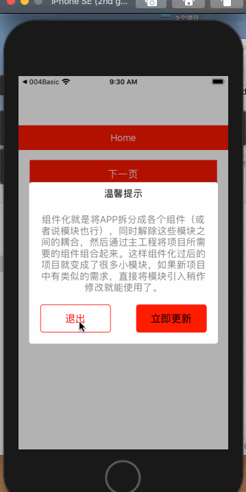
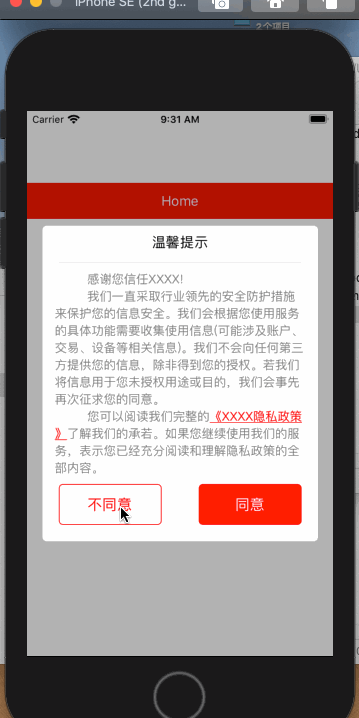
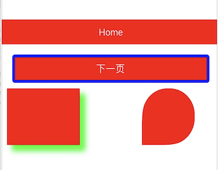
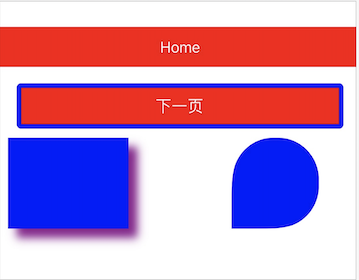

# NITools


[](https://travis-ci.org/nixinsheng/NITools)
[](https://cocoapods.org/pods/NITools)
[](https://cocoapods.org/pods/NITools)
[](https://cocoapods.org/pods/NITools)

## Example

To run the example project, clone the repo, and run `pod install` from the Example directory first.

## 效果
 - 自定义view组件效果



 - 阴影、指定圆角、暗黑颜色适配




## 使用示例
 - 参见./Example/NITools/NIViewController.m

## 版本更新内容
 - 计划更新：组件的色系要能统一修改、组件属性尽量多开放、属性能精细修改、（NITools待更新）
 
 - tag:0.2.2 - NITools:(UITextField+Check)
             - // 判断输入框内容是否为空
             /*
               中国移动:
               135、136、137、138、139、147（数据卡）、148、150、151、152、157、158、159、178、182、183、184、187、188、198、
               134（0-8）、1440、1703、1705、1706
               
               中国联通:
               130、131、132、145（数据卡）、146、155、156、166、175、176、185、186、
               1707、1708、1709 、
               
               中国电信:
               133、149、153、173、177、180、181、189、199、
               1349、1410、1700、1701、1702、
               
               虛拟运营商: 1700、1705、1707、1708、1709......代理联通移动电信业务
               
               */
             - // 判断手机号码格式是否正确
             - // 判断秘密格式为 6 - 18 位数字和字母组成
             - // 长度是否超过6位数并小于18位数             
 - tag:0.2.1 - NITools:(NSString+VersionCompare)新增获取当前版本号(实例)方法;
             - NITools:NISandBoxTools.h/m 工具类新增;
 - 2020年10月12日16:52:37-Example 测试案例里新增 pod 引入 pod 'YYKit', '~> 1.0.9',实际项目当中一定注意YYkit的完全引入和单独引入某一个分支可能会产生冲突，这个项目搭建时候一定要好好斟酌
 - tag:0.2.0 - NITools：pod类里使用图片资源文件-优化抽离NSBundle+NILibrary、UIImage+NILibrary分类 
 - tag:0.1.9 - NITools：自定义View(NINetworkDetectionView.h/m-加载图片优化)使用资源文件-优化NSBundle引入资源文件 
 - tag:0.1.8 - NITools：自定义View(NINetworkDetectionView.h/m)使用资源文件-优化NSBundle引入资源文件
 - tag:0.1.7 - NITools：自定义View(NINetworkDetectionView.h/m)使用资源文件
 - tag:0.1.6 - NITools：优化NITools.podspec 去除s.dependency 'AFNetworking'强制要求的版本
 - tag:0.1.5 - NITools：优化UIView+NIFrame.h/m-支持设置圆角、设置边框、设置圆角&边框、给指定哪几个角设置圆角、设置阴影；新增：UIColor+NIColor.h/m适配暗黑模式颜色
 - tag:0.1.4 - NITools：常用宏整理NIMacro/Macro.h(注:你可以拷贝出来放到你工程的PCH里,也可以PCH里直接引用该头文件)
 - tag:0.1.3 - NITools：新增NSString分类(NSString+VersionCompare.h/m)-app发布版本号比较;新增获取ip地址工具类-支持获取ipv6地址
 - tag:0.1.2 - NITools：优化NIPrivacyView.h/m(开放尽可能多的属性-方便使用者精细定制化)-「个人实践：pod lib编译验证不过、pod trunk push上传异常、 trunk push 到 CocoaPods 成功后 pod search 却搜不到的解决方法」;Allow Non-modular includes in Framework Mo 「修复」;
    <p style="color:red">-需要详细资料小伙伴联系我微信:wvqusrtg</p>

 - tag:0.1.0 - NITools：自定义view分类(UIView+NIFrame.h/m)、启动隐私政策自定义view组件(NIPrivacyView.h/m)、版本更新自定义view组件(NIVersionManagerView.h/m)

## Requirements

- iOS 8.0 or later

## Installation

NITools is available through [CocoaPods](https://cocoapods.org). To install
it, simply add the following line to your Podfile:

```ruby
pod 'NITools', '~> 0.2.1'
```

## Author

<p style="color:red">nixinsheng, 1911398892@qq.com</p>

有问题微信联系包教会「注明来意」-本人微信号:wvqusrtg

## License

NITools is available under the MIT license. See the LICENSE file for more info.

NITools

## Tips
- pod 提交
```
1.验证库是否有问题
pod lib lint NITools.podspec --use-libraries --allow-warnings
2.提交库
pod trunk push NITools.podspec --use-libraries --allow-warnings
```